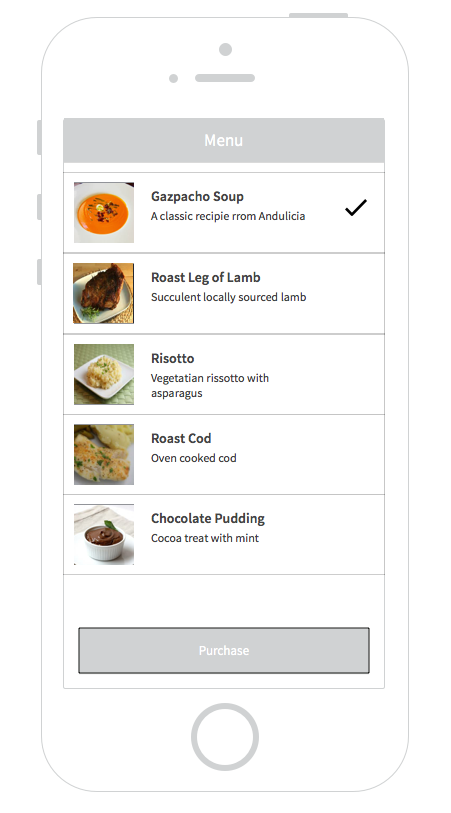
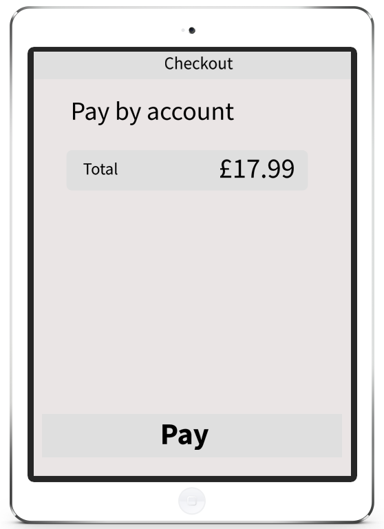

# Food Delivery Code Test

## Class Hierarchy Design
1. Design a simple class hierarchy, in the programming language of your choice (PHP preferably), that models the act of food delivery.

  In terms of an agnostic REST api (used by Node for instance, which would be relatively easy to set up on a local machine )

  ```
  # customer creation and retrieval
  /api/customer/login
  /api/customer/add


  # retrieval of all the possible food items
  /api/menu

  # workflow to choose and buy
  /api/cart/order
  /api/cart/purchase

  # check details of (the last) and all orders
  /api/customer/history

  ```

2. You should have at least three classes and a workflow for a client to order food.

I'll stub out some directives and controllers for the workflow:

**login**
- login.ctrl.js
- add.dir.js
- add.html
- login.dir.js
- login.html

**menu**
- menu.ctrl.js
- menu.dir.js
- menu.html

**cart**
- cart.ctrl.js
- order.dir.js
- order.html
- purchase.dir.js
- purchase.html
- history.dir.js
- history.html


3 Provide (pseudo) code that defines the classes and the components that use the classes. Explain the relationship between the classes and components.

I've added working stub JS classes for the menu package.

See: [Menu](www/js/menu/menu.dir.js)

The `menu` component consists of a Directive which is responsible for populating it's view (`menu.html`) with the menu data.

The Controller (`menu.ctrl.js`) receives an update and would be responsible for mediating this.

Using a Service (`menu.svc.js`) ensures loose coupling.


4 Employ two software design patterns and explain how you would use them in your components.

Some "classic" GOF design patterns employed are the _Facade_ in the `menu.svc.js`, in that in provides an interface to the menu api.

Also, the `menu.svc.js` is a Singleton, as _".. one object is needed to coordinate actions across the system..."_

Angular Directives are in their nature Composites as they are composed of the JS code and their own view (the template).


5 Explain how you configure your components.

I configure my components to be modular - hence the use of the `cart`, `login` and `menu` folders rather than grouped as controllers and directives.


6 What features would your design need to scale?

The modularity would help with ths scaling of the code-base.


## Unit Testing
1. Write unit tests for the core components in your hierarchy.
TODO

2. Provide (pseudo) code that defines the tests for the components.
3. Explain why the tests are necessary.

## User Interface Design
1 Choose a language or toolset to write a UI to expose the business logic you created in your class hierarchy (Bootstrap + Javascript preferably).

It would be nice to use [material](http://ionicmaterial.com) to create some funky looking app.

I've done some experiments using the following design tools:

- [Sketch](http://www.bohemiancoding.com/sketch/) - using an Ionic template

- PhotoShop - using an Ionic PSD template

- [Adobe Comp CC](https://itunes.apple.com/us/app/adobe-comp-cc/id970725481?mt=8) for the iPad

**Very quick sketches**

<div>
 <li>Login using PhotoShop
    
  </li>
</div>

<br>

<div>
  <li>Menu using Sketch
     
   </li>
</div>

<br>

<div>
  <li>Checkout designed in Adobe Comp CC, then touched up in PhotoShop.
     
   </li>
</div>
    
<br>
<br>

2 Provide a "mock up" of the UI workflow.  This does not have to be exact; the goal is to identify how you the UI would "use" your classes.  You can provide a drawing, diagram, or (pseudo) code that shows your UI design.

The app is currently running as a tab app, this isn't the correct UI workflow. As each view should be viewed in turn, and the user should be able to jump from login to the cart.

Should be more like the following:

| **State** | **View** | **Transition** |
| :------- | :-------  | :------------  |
| start     | Login    | -> loggedin    |
| add       | Login    | -> start       |
| loggedin  | menu     | -> cart        |
| cart      | cart     | -> ordering    |
| ordering  | cart     | -> purchasing  |
| purchasing| cart     | -> cart        |

It would be nice to get some designs made with [Ionic Creator](http://ionicframework.com/creator/)


## Database
1 Choose a database to back your class hierarchy.

Possible database solutions:

- MongoDB
- MySQL
- Firebase
- PlayFramework

2 Explain the pros and cons of operating the database solution you chose.

I would have to do some further investigations regarding this issue, I've used Firebase before., but I'd ratehr use something more suitable to using a RESTful approach.

# Ionic

I used the default "tab" starter app, to build and test:

```
$ ionic platform add ios

$ ionic build ios

$ ionic emulate ios

```
